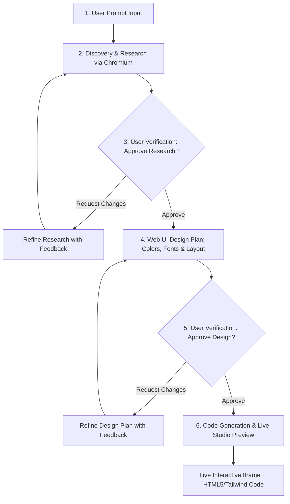

# AI UI Studio

An end-to-end, agentic Web UI Generation Pipeline and Interactive React Studio powered by AI and Headless Chromium.

---

## 🚀 Interactive Studio Flow



---

## ⚡ Token Limit Budgets
- **Discovery & Research Stage**: Max **10,000 tokens** per session.
- **Web UI Design Plan Stage**: Max **10,000 tokens** per session.
- Tracked in real-time in the backend and visualized on the frontend Token HUD.

---

## 📁 Project Structure

```
ai-ui-studio/
├── frontend/                      # React 19 + Tailwind v4 + Vite Studio Interface
│   ├── src/
│   │   ├── App.jsx                # Full interactive pipeline with Live Iframe Studio & Token HUD
│   │   └── index.css              # Tailwind imports
│   └── package.json
├── output/
│   └── index.html                 # Auto-saved generated website output
├── src/
│   ├── config/
│   │   └── pipeline.json          # Active skills, tools & pipeline settings
│   ├── core/
│   │   ├── model.js               # Streaming LLM client with auto-retry
│   │   ├── pipeline.js            # Agentic pipeline orchestrator
│   │   └── token_tracker.js       # 10k token budget limiter
│   ├── skills/
│   │   ├── research_user_prompt.md# Stage 1: Discovery & entity research
│   │   ├── ui-design-plan.md      # Stage 2: Dynamic UI/UX design architecture
│   │   └── ui-code-generator.md   # Stage 3: HTML5 + Tailwind CSS + Fonts/Icons code generator
│   ├── tools/
│   │   └── web_search.js          # Puppeteer Chromium search & deep scraper
│   └── server.js                  # Express API Server connecting backend to frontend
├── tests/
│   └── test_run.js                # Integration and connectivity test runner
├── .env                           # Environment variables (BASE_URL, MODEL_NAME, TIMEOUT)
├── index.js                       # CLI entry point
├── package.json
└── README.md
```

---

## 🌐 Running the Fullstack Application

### 1. Start the Backend API Server:
```powershell
npm run server
```
*Backend runs on `http://localhost:5000`*

### 2. Start the React Frontend:
In a new terminal:
```powershell
cd frontend
npm run dev
```
*Frontend runs on `http://localhost:5173`*

---

## 💻 Running via CLI
You can also run the pipeline directly in your terminal:
```powershell
node index.js "I want to build a landing page for an AI resume builder called ResumeAI"
```
