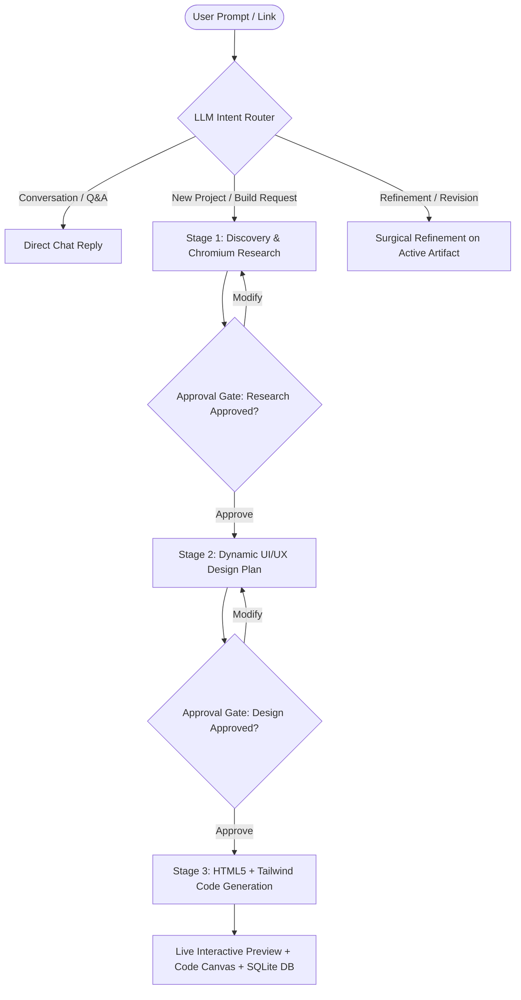

# 🎨 AI UI STUDIO

[](https://github.com/shah-ashish/AI-UI-STUDIO/actions/workflows/ci-cd.yml)
[](https://nodejs.org/)
[](https://github.com/shah-ashish/AI-UI-STUDIO/pkgs/container/AI-UI-STUDIO)
[](LICENSE)

An intelligent, autonomous **Chat + Artifacts Workspace** (Claude & v0 style) for generating, refining, and compiling fullstack web interfaces and prototypes using local LLMs (via Ollama) and Headless Chromium.

---

## 🌟 Key Features

- **💬 Conversational Chat + Canvas Workspace**: Multi-turn conversation feed on the left with inline background task milestones, and an interactive multi-tab Artifacts Canvas on the right (Live Preview, Clean Code, Design Specification, Research Dossier).
- **🧠 Model-Driven Autonomous Routing**: The LLM autonomously classifies user intent from context—answering conversational questions directly, or triggering research, design, and code generation stages without hardcoded keywords.
- **⚡ Live Token Streaming**: Token-by-token real-time streaming into conversation bubbles and live code editors via Server-Sent Events (SSE).
- **🛡️ Interactive Review & Approval Gates**: Human-in-the-loop approval buttons (`[✓ Approve & Proceed to Design]`, `[⚡ Approve & Generate Code]`) between stages to review and request modifications before committing tokens.
- **📍 Real-Time Web & Google Maps Scraper**: Instant redirect resolution and extraction for external URLs and Google Maps shortlinks (`maps.app.goo.gl`), feeding business data and contextual details directly to the model.
- **🗄️ SQLite Persistent History**: Saved chat sessions, prompt revisions, version histories, and token tracking automatically persisted in local SQLite.
- **🛑 Generation Cancellation**: Instant AbortController stop trigger to cancel long-running LLM inferences on demand.

---

## 🏗️ Architecture & Workflow



---

## 🚀 Ways to Start AI UI Studio

### Option 1: Cloud / Remote One-Liner (Google Colab, Kaggle, VPS)

Run AI UI Studio in any remote Linux environment with a single command. The script automatically installs system dependencies, starts Ollama, pulls the model with progress tracking, builds frontend assets, and exposes the app online via **Pinggy** and **Cloudflare**:

```bash
# Default launch (qwen3.8:27b)
curl -fsSL https://raw.githubusercontent.com/shah-ashish/AI-UI-STUDIO/main/run.sh | bash

# In Google Colab or Kaggle Notebook (prepend with !)
!curl -fsSL https://raw.githubusercontent.com/shah-ashish/AI-UI-STUDIO/main/run.sh | bash -
```

#### Running with a Custom Model:
You can specify any Ollama model as an argument. For Kaggle / Colab free GPU tiers (16 GB VRAM), **`qwen2.5-coder:14b`** or **`qwen2.5-coder:7b`** is highly recommended for 2-second responses:

```bash
!curl -fsSL https://raw.githubusercontent.com/shah-ashish/AI-UI-STUDIO/main/run.sh | bash -s -- qwen2.5-coder:14b
```

---

### Option 2: Docker & Docker Compose (Recommended for Production)

AI UI Studio includes a multi-stage `Dockerfile` and `docker-compose.yml` for unified containerization:

#### Using Docker Compose (App + Ollama):
```bash
# 1. Clone repository
git clone https://github.com/shah-ashish/AI-UI-STUDIO.git
cd AI-UI-STUDIO

# 2. Launch services
docker compose up --build
```
*Open [http://localhost:5000](http://localhost:5000) in your browser.*

#### Using Standalone Docker:
```bash
# Build Docker image
docker build -t ai-ui-studio .

# Run container (pointing to host machine Ollama)
docker run -d \
  -p 5000:5000 \
  -e BASE_URL=http://host.docker.internal:11434 \
  -e MODEL_NAME=qwen2.5-coder:14b \
  -v $(pwd)/data:/app/data \
  --name ai-ui-studio \
  ai-ui-studio
```

---

### Option 3: Local Node.js Development

#### Prerequisites
- **Node.js**: `v22.0.0` LTS or higher
- **Ollama**: Installed and running locally (`ollama serve`)

```bash
# 1. Clone repository and install dependencies
git clone https://github.com/shah-ashish/AI-UI-STUDIO.git
cd AI-UI-STUDIO
npm install

# 2. Build the React frontend
npm run build:frontend

# 3. Create .env configuration
cat <<EOF > .env
PORT=5000
BASE_URL=http://localhost:11434
MODEL_NAME=qwen2.5-coder:14b
TIMEOUT=1200
EOF

# 4. Start Unified Server
npm run server
```
*Access the unified studio at [http://localhost:5000](http://localhost:5000).*

#### Active Development Mode (Hot-Reloading):
For developing the React frontend with instant Vite HMR:
```bash
# Terminal 1: Backend API
npm run server

# Terminal 2: Vite Dev Server
cd frontend
npm run dev
```
*Frontend dev server runs at [http://localhost:5173](http://localhost:5173) and proxies API requests to port 5000.*

---

### Option 4: Headless CLI Mode

Generate websites directly from your terminal without opening a browser:

```bash
node index.js "Build a modern dark-mode landing page for a developer API monitoring tool called PulseOps"
```
The output will be saved automatically to `output/index.html`.

---

## ⚙️ Environment Configuration (`.env`)

| Variable | Default | Description |
| :--- | :--- | :--- |
| `PORT` | `5000` | Port for Express server (serves API & static frontend) |
| `BASE_URL` | `http://localhost:11434` | Ollama API endpoint |
| `MODEL_NAME` | `qwen2.5-coder:14b` | LLM model identifier in Ollama |
| `TIMEOUT` | `1200` | Generation timeout in seconds (20 minutes) |

---

## 🎯 Recommended Models

| Model | Size | VRAM Needed | Best For |
| :--- | :--- | :--- | :--- |
| **`qwen2.5-coder:7b`** | 4.7 GB | ~6 GB | Ultra-fast generation on laptops & free cloud tiers |
| **`qwen2.5-coder:14b`** | 9.0 GB | ~11 GB | **Recommended balance** of complex UI design & speed |
| **`qwen2.5-coder:32b`** | 20 GB | ~24 GB | Full production-grade UI apps and intricate animations |
| **`qwen3.8:27b`** | 16 GB | ~18 GB | Advanced reasoning and detailed research dossiers |

---

## 🧪 Testing & Verification

The project includes unit, integration, and API test suites powered by Node's native test runner (`node:test`):

```bash
# Run all unit and API test suites
npm test

# Run single model integration test against live Ollama
npm run test:integration
```

### Test Coverage Includes:
- **`tests/db.test.js`**: SQLite initialization, project CRUD, chat message persistence, milestone updating, and cascade deletion.
- **`tests/token_tracker.test.js`**: Token estimation heuristics, session accumulation, and stage budget ceilings.
- **`tests/url_scraper.test.js`**: URL sanitization, redirect following, Google Maps place decoding, and business name extraction.
- **`tests/server_api.test.js`**: Healthcheck, project listing, session usage, reset, and error validation endpoints.

---

## 🔄 CI/CD Pipeline

The repository uses **GitHub Actions** (`.github/workflows/ci-cd.yml`) for automated testing and image deployment:

1. **Test Job**:
   - Checks out code on Ubuntu 22.04 with Node.js 22 LTS.
   - Installs backend and frontend dependencies.
   - Runs full test suite (`npm test`).
   - Verifies frontend static compilation (`npm run build`).
2. **Docker Job**:
   - Sets up Docker Buildx.
   - Builds multi-stage production container image.
   - Verifies container healthcheck.
   - Publishes image to **GitHub Container Registry (GHCR)** on `push` to `main`.

---

## 📂 Repository Structure

```
AI-UI-STUDIO/
├── .github/
│   └── workflows/
│       └── ci-cd.yml              # Automated testing & Docker GHCR build workflow
├── frontend/                      # React 19 + Tailwind v4 + Vite Studio Interface
│   ├── src/
│   │   ├── api/                   # SSE client & API callers
│   │   ├── components/
│   │   │   └── ChatWorkspace/     # Sidebar, ChatView, ChatBubble, MilestoneTracker, ArtifactViewer
│   │   └── hooks/                 # useChatSession state & streaming controller
│   └── package.json
├── src/
│   ├── core/
│   │   ├── chat_orchestrator.js   # LLM intent classifier & turn coordinator
│   │   ├── db.js                  # SQLite database engine (projects & chat history)
│   │   ├── model.js               # Streaming Ollama client with auto-retry
│   │   └── token_tracker.js       # Budget limiter & token estimator
│   ├── skills/                    # Specialized prompt engineering markdown specifications
│   ├── tools/
│   │   ├── url_scraper.js         # HTTP redirect resolver & Puppeteer scraper
│   │   └── web_search.js          # Organic Chromium search engine
│   └── server.js                  # Express API server with unified frontend serving
├── tests/                         # Unit & integration test suites
├── Dockerfile                     # Multi-stage production container definition
├── docker-compose.yml             # App + Ollama orchestrator
├── run.sh                         # Linux/Colab/Kaggle one-liner deployment script
├── index.js                       # CLI pipeline runner
├── package.json
└── README.md
```

---

## 📄 License

ISC License © 2026 Ashish Kumar Shah
